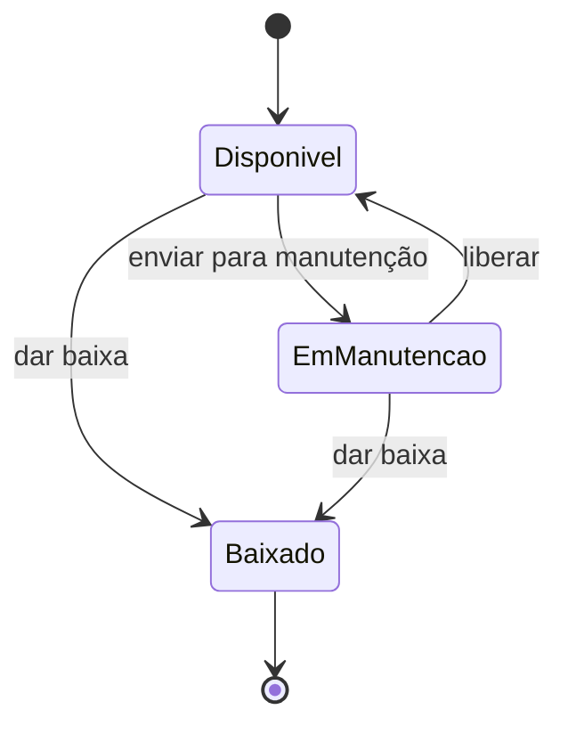

# SPEC 0001 — Catálogo de recursos

- **Status:** Rascunho
- **Data:** 2026-10-08
- **Autores:** Hugo Pontello
- **Contextos afetados:** Catálogo

## Objetivo

Permitir que o(a) técnico(a) de laboratório cadastre os recursos reserváveis do departamento —
laboratórios, bancadas e equipamentos — e controle o estado operacional de cada um, e que qualquer
usuário consulte o catálogo.

## Decisões relacionadas

- [ADR 0001](../adr/0001-stack-tecnologica.md) — implementação em Java/Spring Boot no back-end e
  React/TypeScript no front-end.
- [ADR 0002](../adr/0002-ddd-no-backend.md) — `Recurso` é um agregado do contexto de Catálogo, com
  mudanças de estado por métodos de domínio e sem setters públicos; o domínio não depende do Spring.
- [ADR 0003](../adr/0003-spec-driven-development.md) — esta especificação precede a implementação.

Ainda não há ADR de banco de dados. Até que exista, o repositório é implementado **em memória** (os
dados se perdem ao reiniciar a aplicação). A interface do repositório fica no domínio, de modo que a
troca pelo banco não altera o domínio nem a API.

## Escopo

Entra:

- Cadastrar recurso.
- Listar recursos e consultar um recurso pelo identificador.
- Mudar o estado operacional: enviar para manutenção, liberar da manutenção e dar baixa.
- Informar se um recurso pode ser reservado por um perfil de usuário (usado depois pela Reserva).
- Tela de listagem e de cadastro no front-end.

Não entra:

- Autenticação e controle de quem pode cadastrar: ainda não há login. O perfil é informado na
  consulta de elegibilidade.
- Edição e exclusão de recurso. Um recurso que sai de uso recebe baixa, não é apagado.
- Efeito da manutenção sobre reservas existentes e notificação dos envolvidos: tratados em
  especificação própria, depois que o contexto de Reserva existir.
- Vínculo entre equipamento e laboratório.

## Comportamento

### Cadastro

1. O(a) técnico(a) informa nome, tipo, localização e capacidade.
2. O sistema valida os dados e cria o recurso com um identificador (UUID) e estado **Disponível**.
3. O sistema devolve o recurso criado.

### Regras

**Tipos de recurso:** Laboratório, Bancada e Equipamento.

**Dados do recurso** (valores provisórios, definidos pela equipe nesta especificação):

| Campo | Regra |
| --- | --- |
| Nome | obrigatório, de 3 a 100 caracteres, sem espaços nas pontas; único no catálogo, sem diferenciar maiúsculas de minúsculas |
| Tipo | obrigatório |
| Localização | obrigatória, até 100 caracteres (ex.: "DCC — Bloco 2, sala 105") |
| Capacidade | número de pessoas; de 1 a 100. Para Equipamento é sempre 1 |

**Estados operacionais e transições:**

- Baixado é estado final: nenhuma transição sai dele.
- Transição não prevista no diagrama é rejeitada, e o estado não muda.

**Elegibilidade** (valores provisórios):

| Tipo | Perfis que podem reservar |
| --- | --- |
| Laboratório | Docente, Coordenação |
| Bancada | Docente, Discente, Coordenação |
| Equipamento | Docente, Discente, Coordenação |

Um recurso só é reservável se estiver **Disponível** e o perfil for elegível para o tipo dele.

### API

| Método e caminho | Ação | Sucesso |
| --- | --- | --- |
| `POST /api/catalogo/recursos` | cadastra | `201` com o recurso |
| `GET /api/catalogo/recursos` | lista todos, ordenados por nome | `200` |
| `GET /api/catalogo/recursos/{id}` | consulta um | `200` |
| `POST /api/catalogo/recursos/{id}/manutencao` | envia para manutenção | `200` com o recurso |
| `POST /api/catalogo/recursos/{id}/liberacao` | libera da manutenção | `200` com o recurso |
| `POST /api/catalogo/recursos/{id}/baixa` | dá baixa | `200` com o recurso |
| `GET /api/catalogo/recursos/{id}/elegibilidade?perfil=DISCENTE` | informa se é reservável pelo perfil | `200` com `{ "reservavel": true }` |

Erros respondem com `{ "mensagem": "..." }` em português.

## Casos de borda e erro

| Situação | Resultado |
| --- | --- |
| Campo obrigatório ausente ou fora dos limites | `400`, mensagem indicando o campo |
| Nome já cadastrado (inclusive com outra caixa, ex.: "lab 1" e "LAB 1") | `409` |
| Equipamento cadastrado com capacidade diferente de 1 | `400` |
| Identificador inexistente | `404` |
| Transição de estado inválida (ex.: liberar um recurso Disponível, qualquer ação em Baixado) | `409`, estado inalterado |
| Perfil desconhecido na consulta de elegibilidade | `400` |
| Dois cadastros simultâneos com o mesmo nome | apenas um é criado; o outro recebe `409` |

## Critérios de aceitação

- [ ] Dado um laboratório válido, quando cadastrado, então é criado com estado Disponível e
  identificador gerado, e a resposta é `201`.
- [ ] Dado um nome com 2 caracteres, quando cadastrado, então a resposta é `400`.
- [ ] Dado um recurso "Lab Redes" já cadastrado, quando se cadastra "lab redes", então a resposta é
  `409`.
- [ ] Dado um equipamento com capacidade 5, quando cadastrado, então a resposta é `400`.
- [ ] Dado um recurso Disponível, quando enviado para manutenção, então fica Em manutenção.
- [ ] Dado um recurso Em manutenção, quando liberado, então volta a Disponível.
- [ ] Dado um recurso Disponível, quando liberado, então a resposta é `409` e o estado não muda.
- [ ] Dado um recurso Baixado, quando enviado para manutenção, então a resposta é `409`.
- [ ] Dado um laboratório Disponível, quando consultada a elegibilidade para Discente, então
  `reservavel` é `false`; para Docente, é `true`.
- [ ] Dado uma bancada Em manutenção, quando consultada a elegibilidade para Docente, então
  `reservavel` é `false`.
- [ ] Dado três recursos cadastrados, quando listados, então vêm em ordem alfabética de nome.
- [ ] Dado um identificador inexistente, quando consultado, então a resposta é `404`.
- [ ] Na tela do catálogo, o usuário vê a lista de recursos com tipo, localização, capacidade e
  estado, e consegue cadastrar um novo recurso pelo formulário.

## Questões em aberto

- Os valores de capacidade e a tabela de elegibilidade são provisórios e devem ser validados com o
  corpo técnico do departamento.
- Banco de dados: a persistência em memória vale até o ADR de banco ser aceito.
