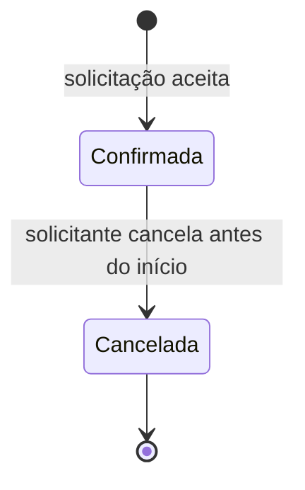

# SPEC 0002 — Solicitar reserva

- **Status:** Rascunho
- **Data:** 2026-10-09
- **Autores:** Hugo Pontello
- **Contextos afetados:** Reserva, Catálogo (consulta)

## Objetivo

Permitir que docentes, discentes e a coordenação reservem um recurso do catálogo para um período,
sem que duas reservas do mesmo recurso se sobreponham, e que consultem e cancelem as próprias
reservas.

## Decisões relacionadas

- [ADR 0002](../adr/0002-ddd-no-backend.md) — `Reserva` é um agregado do contexto de Reserva; o
  período é um objeto de valor (`record`). A Reserva não importa classes de domínio do Catálogo: a
  consulta é feita por uma interface explícita, e o recurso é referenciado apenas pelo identificador.
- [ADR 0003](../adr/0003-spec-driven-development.md) — esta especificação precede a implementação.
- [SPEC 0001](0001-catalogo-de-recursos.md) — define o que é um recurso reservável e a elegibilidade
  por perfil.

Como na SPEC 0001, a persistência é **em memória** até existir ADR de banco de dados.

## Escopo

Entra:

- Solicitar reserva de um recurso para um período.
- Consultar a agenda de um recurso e as reservas de um solicitante.
- Cancelar a própria reserva antes do início.
- Tela de solicitação, agenda e cancelamento no front-end.

Não entra:

- Autenticação: o solicitante se identifica por um texto (e-mail ou matrícula) e informa o perfil.
- Reserva recorrente (semestre inteiro) e prioridade de aula sobre uso individual.
- Notificação de confirmação e cancelamento por manutenção: especificações próprias.
- Registro de retirada e devolução de equipamentos.

## Comportamento

### Fluxo principal

1. **[Reserva]** O solicitante informa recurso, identificação, perfil, início e fim.
2. **[Reserva]** O sistema valida o período e as regras de antecedência e duração.
3. **[Reserva → Catálogo, síncrono]** O sistema pergunta ao Catálogo se o recurso existe e se é
   reservável pelo perfil (SPEC 0001: disponível e perfil elegível).
4. **[Reserva]** O sistema verifica o limite de reservas ativas do solicitante.
5. **[Reserva]** O sistema verifica conflito com as reservas confirmadas do mesmo recurso.
6. **[Reserva]** A reserva é criada no estado **Confirmada** e devolvida ao solicitante.

Os passos 4 a 6 ocorrem de forma atômica: duas solicitações simultâneas não podem ser ambas
confirmadas se, juntas, violarem o conflito de agenda (mesmo recurso) ou o limite de reservas ativas
(mesmo solicitante, ainda que para recursos diferentes). Com o repositório em memória, basta
serializar as solicitações no serviço de aplicação.

O passo 3 fica fora do bloco atômico, porque lê dados de outro contexto. Se o recurso entrar em
manutenção entre a consulta e a confirmação, a reserva é confirmada mesmo assim. Essa é a janela de
consistência eventual prevista na [visão de produto](../visao-produto.md), e será fechada pela
compensação (cancelamento das reservas afetadas), tratada em especificação própria.

### Regras

Valores provisórios, definidos pela equipe nesta especificação:

| Regra | Valor |
| --- | --- |
| Horário de funcionamento | início a partir das 07:00 e fim até as 22:00, inclusive; início e fim no mesmo dia |
| Duração | de 30 minutos a 4 horas, inclusive |
| Antecedência mínima | início pelo menos 1 hora depois do momento da solicitação (exatamente 1 hora é aceito) |
| Antecedência máxima | início no máximo 30 dias depois do momento da solicitação (exatamente 30 dias é aceito) |
| Reservas ativas por solicitante | Discente: até 3; Docente e Coordenação: até 10 |

O perfil Técnico não reserva: nenhum tipo de recurso o aceita na elegibilidade da SPEC 0001, então
a solicitação é recusada no passo 3, antes da verificação de limite.

- **Solicitante:** a identificação é comparada sem os espaços das pontas e sem diferenciar maiúsculas
  de minúsculas, no limite de reservas, no cancelamento e na consulta. `" Joao@ufla.br"` e
  `"joao@ufla.br"` são a mesma pessoa.
- **Reserva ativa** é uma reserva Confirmada cujo fim ainda não passou.
- **Conflito:** dois períodos do mesmo recurso conflitam quando um começa antes do outro terminar
  (`inicioA < fimB` e `inicioB < fimA`). Períodos encostados (um termina às 10:00 e o outro começa
  às 10:00) não conflitam.
- Reservas canceladas não contam para conflito nem para limite.
- **Fuso horário:** início e fim são enviados sem fuso e interpretados no fuso `America/Sao_Paulo`.
  O "agora" das regras de antecedência e de reserva ativa também é calculado nesse fuso, de forma
  independente do fuso do servidor. O relógio é injetado no serviço, para que os testes possam
  fixar o momento atual.

### Ciclo de vida



Só quem solicitou pode cancelar. Uma reserva já iniciada não pode ser cancelada.

### API

| Método e caminho | Ação | Sucesso |
| --- | --- | --- |
| `POST /api/reservas` | solicita | `201` com a reserva |
| `GET /api/reservas?recursoId={id}` | agenda do recurso, por início | `200` |
| `GET /api/reservas?solicitante={texto}` | reservas do solicitante, por início | `200` |
| `POST /api/reservas/{id}/cancelamento` | cancela; corpo `{ "solicitante": "..." }` | `200` com a reserva |

Corpo da solicitação:

```json
{
  "recursoId": "uuid",
  "solicitante": "joao@estudante.ufla.br",
  "perfil": "DISCENTE",
  "inicio": "2026-10-20T14:00",
  "fim": "2026-10-20T16:00"
}
```

A consulta `GET /api/reservas` exige exatamente um dos filtros, `recursoId` ou `solicitante`. Sem
filtro ou com os dois, a resposta é `400`, para não expor as reservas de todos os usuários. Um
`recursoId` sem reservas, inclusive um que não existe no Catálogo, devolve `200` com lista vazia.

Erros respondem com `{ "mensagem": "..." }` em português.

## Casos de borda e erro

| Situação | Resultado |
| --- | --- |
| Campo ausente, data malformada ou perfil desconhecido | `400` |
| Fim antes ou igual ao início | `400` |
| Fora do horário de funcionamento ou em dias diferentes | `400` |
| Duração menor que 30 minutos ou maior que 4 horas | `400` |
| Início em menos de 1 hora ou a mais de 30 dias | `400` |
| Recurso não existe no Catálogo | `404` |
| Recurso em manutenção, baixado ou não elegível para o perfil | `422` |
| Limite de reservas ativas atingido | `422` |
| Período conflita com reserva confirmada do recurso | `409` |
| Duas solicitações simultâneas para o mesmo horário | uma `201`, a outra `409` |
| Duas solicitações simultâneas do mesmo solicitante que, juntas, passam do limite | uma `201`, a outra `422` |
| Consulta sem filtro ou com os dois filtros | `400` |
| Reserva inexistente no cancelamento | `404` |
| Cancelamento por outro solicitante | `403` |
| Cancelamento de reserva já cancelada ou já iniciada | `409` |

## Critérios de aceitação

- [ ] Dado um laboratório disponível e um docente, quando ele solicita terça das 14:00 às 16:00, então
  a reserva é criada como Confirmada (`201`).
- [ ] Dado uma reserva confirmada das 14:00 às 16:00, quando outra é solicitada das 15:00 às 17:00
  para o mesmo recurso, então a resposta é `409`.
- [ ] Dado uma reserva confirmada das 14:00 às 16:00, quando outra é solicitada das 16:00 às 18:00,
  então é aceita.
- [ ] Dado uma reserva cancelada das 14:00 às 16:00, quando outra é solicitada no mesmo horário, então
  é aceita.
- [ ] Dado um início daqui a 30 minutos, quando solicitado, então a resposta é `400`.
- [ ] Dado uma duração de 5 horas, quando solicitado, então a resposta é `400`.
- [ ] Dado um período das 21:00 às 23:00, quando solicitado, então a resposta é `400`; das 20:00 às
  22:00, é aceito.
- [ ] Dado um início exatamente 1 hora depois do momento da solicitação, quando solicitado, então é
  aceito.
- [ ] Dado um discente com 3 reservas ativas como `joao@ufla.br`, quando solicita a quarta como
  `" JOAO@ufla.br"`, então a resposta é `422`.
- [ ] Dado um servidor com fuso UTC, quando são 13:00 no campus e se solicita das 14:30 às 16:00 do
  mesmo dia, então é aceito.
- [ ] Dado uma consulta `GET /api/reservas` sem filtro, então a resposta é `400`.
- [ ] Dado um discente, quando solicita um laboratório, então a resposta é `422`.
- [ ] Dado um recurso em manutenção, quando solicitado, então a resposta é `422`.
- [ ] Dado um discente com 3 reservas ativas, quando solicita a quarta, então a resposta é `422`.
- [ ] Dado uma reserva confirmada futura, quando o próprio solicitante cancela, então ela fica
  Cancelada; quando outra pessoa tenta cancelar, a resposta é `403`.
- [ ] Na tela, o usuário escolhe um recurso, vê a agenda dele, solicita uma reserva e cancela uma
  reserva própria, vendo a mensagem de erro quando a API recusa.

## Questões em aberto

- Os valores da tabela de regras são provisórios e devem ser validados com a coordenação.
- Prioridade de aula sobre uso individual: ainda sem regra definida.
- Quando o Catálogo virar serviço separado e estiver fora do ar no passo 3, recusar a solicitação ou
  aceitá-la como provisória? Por enquanto a chamada é dentro do mesmo processo; a decisão será
  registrada em ADR (ver visão de produto).
- Efeito da manutenção de um recurso sobre reservas já confirmadas: especificação própria.
- As convenções de fuso horário e de identificação do solicitante valem para o sistema todo, não só
  para a Reserva. Sugere-se registrá-las em ADR antes da especificação de Notificação.
