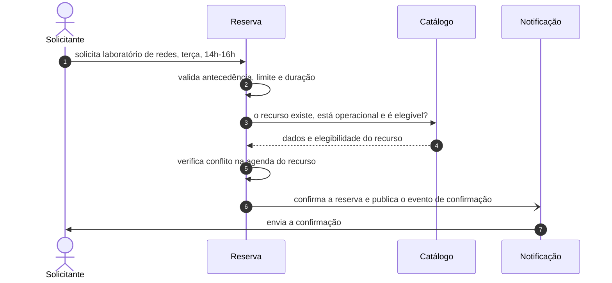

# Visão de Produto

## O problema

Laboratórios e equipamentos da universidade são recursos escassos e disputados. O agendamento desses
recursos acontece hoje de forma dispersa: planilhas compartilhadas, mensagens em grupos, cadernos na
secretaria do departamento e e-mails para o técnico responsável.

Disso decorrem:

- **Conflitos de reserva.** Duas turmas alocadas no mesmo laboratório e horário, sem que nenhuma das
  duas tenha como saber disso antes.
- **Ociosidade não aproveitada.** Um laboratório reservado e não utilizado permanece bloqueado, por
  não haver forma simples de liberar o horário.
- **Falta de rastreio de equipamentos.** Não há registro de quem está com cada equipamento, desde
  quando e com que prazo de devolução.
- **Avisos que não chegam.** Manutenção não programada, cancelamento de aula ou troca de sala não
  alcançam quem tinha reserva.
- **Ausência de dados agregados.** A coordenação não consegue apurar a taxa de uso de um laboratório
  no semestre sem compilar planilhas manualmente.

A causa comum é a inexistência de uma fonte única de informação sobre a disponibilidade dos
recursos, somada à comunicação manual das alterações.

## O que será construído

Um sistema web de reserva de laboratórios e equipamentos, que centraliza o catálogo de recursos,
controla a agenda de uso e notifica os envolvidos quando há alteração.

O escopo é o de um departamento acadêmico: laboratórios de ensino e pesquisa e os equipamentos
associados a eles.

## Público

| Perfil | Necessidade |
| --- | --- |
| **Docente** | Reservar laboratório para uma disciplina, no semestre inteiro ou em datas pontuais |
| **Discente** | Reservar bancada ou equipamento para projeto, TCC ou pesquisa |
| **Técnico(a) de laboratório** | Manter o catálogo, bloquear recursos para manutenção, registrar retirada e devolução |
| **Coordenação** | Consultar a ocupação, resolver conflitos e autorizar exceções |

Os usuários primários são docentes e discentes, que fazem as reservas. A adoção pelo corpo técnico é
condição para o funcionamento do sistema, já que é ele quem mantém a informação sobre o estado
físico dos recursos.

## Contextos delimitados

O sistema é dividido em três contextos, que devem se tornar microsserviços conforme o trabalho
avança. Cada um é responsável pelo próprio modelo e pela própria base de dados.

### Catálogo

Responsável pelo que existe e pode ser reservado: laboratórios, salas, bancadas e equipamentos;
características de cada recurso, como capacidade, localização e mobilidade; estado operacional
(disponível, em manutenção, baixado); e regras de elegibilidade sobre quem pode reservar cada tipo
de recurso.

Não trata de agenda. Um recurso em manutenção deixa de ser reservável, e o efeito disso sobre as
reservas existentes é tratado pelo contexto de Reserva.

### Reserva

Responsável pelo uso dos recursos ao longo do tempo e pela ausência de conflitos. Guarda o ciclo de
vida da reserva, aplica as regras de negócio — antecedência, duração máxima, limite de reservas
simultâneas por usuário, prioridade de aula sobre uso individual — e garante a exclusão mútua na
linha do tempo de cada recurso.

É o contexto com maior complexidade de regras e com as invariantes mais rígidas.

### Notificação

Responsável por transformar em mensagens os eventos recebidos dos demais contextos: confirmação de
reserva, lembrete de início, aviso de cancelamento por manutenção, cobrança de devolução em atraso.
Trata da preferência de canal, do reenvio em caso de falha e do histórico de envios.

Não decide se alguém deve ser notificado, apenas como entregar a notificação decidida em outro
contexto.

## A transação entre contextos

A operação que justifica a separação em contextos, e que serve de fio condutor para o projeto, é a
confirmação de uma reserva.

Depois que os contextos forem separados em serviços, essa transação não poderá ser resolvida por uma
transação ACID única. Ela reúne os problemas que o trabalho precisa tratar:

- **Exclusão mútua.** O passo 5 exige que duas solicitações concorrentes para o mesmo recurso e
  horário não sejam ambas aceitas. Essa invariante pertence a um único contexto, o que determina que
  a agenda não seja distribuída.
- **Consistência eventual.** O passo 3 lê dados de outro contexto. Se o recurso entrar em manutenção
  entre a leitura e a confirmação, haverá reserva confirmada para recurso indisponível. É preciso um
  caminho de compensação: o Catálogo publica a indisponibilização, o contexto de Reserva cancela as
  reservas afetadas e a Notificação avisa os envolvidos. A transação prossegue, portanto, após a
  resposta ao usuário.
- **Falha parcial.** Se a Notificação estiver indisponível no passo 7, a reserva permanece válida,
  pois o envio é assíncrono e reentregável. Se o Catálogo estiver indisponível no passo 3, será
  preciso escolher entre recusar a solicitação e aceitá-la em estado provisório. Essa decisão será
  registrada em ADR.
- **Estilos de integração distintos.** O passo 3 é uma chamada síncrona; os passos 6 e 7 são
  assíncronos, por evento. A transação combina os dois estilos.
